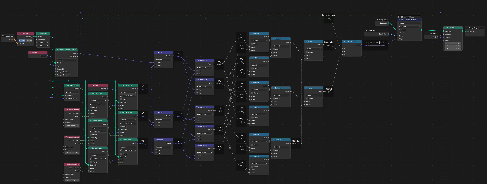
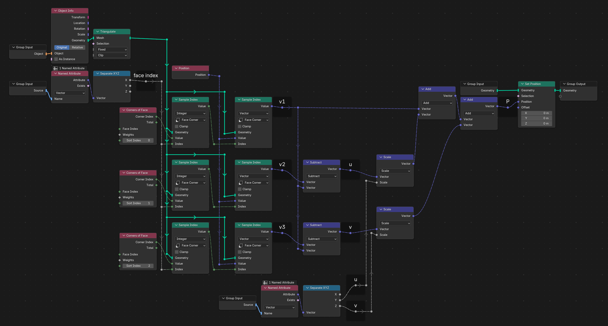

# Snapi

Blender Geometry Node tool

Allow points of object A to snap on nearest surface of object B at time$t_0$
and follow B mesh deformations
(all deformations: transform, modifiers, armature, simulation, etc.)

**Snapi Get node tree**

**Snapi Get node tree**

## How to use

- Create an attribute on the mesh
    - name: "snapi" (example)
    - domain: points
    - type: vector
- Add **Snapi Get** Geometry Node Modifier and feed it with
    - Attribute name ("snapi" in this example)
        - to write in
    - Objet to snap to
- Apply modifier
- Add **Snapi Set** Geometry Node Modifier and feed it with
    - Attribute name ("snapi" in this example)
        - to read from
    - Objet to snap to

## Maths

Triangle &ensp;$`\mathbf{T}`$&ensp; of vertices &ensp;$`A, B, C`$&emsp;
in triangulated mesh to snap to.

Point &ensp$`P_ 0`$&ensp; and &ensp;$`P`$&ensp; the projected point on
&ensp;$`\mathbf{T}`$&ensp; of object to snap.

Vectos &emsp;
$
\vec{u} = \overrightarrow{AB}
\quad;\quad
\vec{v} = \overrightarrow{AC}
$

---

### Snapi get 

**Expressing point "from triangle view"**

$P = A + \lambda \vec{u} + \delta \vec{v}$

$P - A = \lambda \vec{u} + \delta \vec{v}$

$
\begin{cases}
(P - A) \, \vec{u} =
    (\lambda \vec{u} + \delta \vec{v}) \, \vec{u}
    \\[.5em]
(P - A) \, \vec{v} =
    (\lambda \vec{u} + \delta \vec{v}) \, \vec{v}
    \\[.5em]
\vec{w} = P - A
\end{cases}
\quad\Rightarrow\quad
\begin{cases}
\vec{w} \, \vec{u} =
    \lambda \, \vec{u} \, \vec{u} +
    \delta  \, \vec{v} \, \vec{u}
    \\[.5em]
\vec{w} \, \vec{v} =
    \lambda \, \vec{u} \, \vec{v} +
    \delta  \, \vec{v} \, \vec{v}
\end{cases}
\quad\Rightarrow\quad
$

**Express equations in a matrice multiplication form**

$
\mathbf{M} =
\begin{bmatrix}
    \vec{u} \vec{u} & \vec{v} \vec{u} \\
    \vec{u} \vec{v} & \vec{v} \vec{v}
\end{bmatrix} =
\begin{bmatrix}
    \vec{u} \vec{u} & \vec{u} \vec{v} \\
    \vec{u} \vec{v} & \vec{v} \vec{v}
\end{bmatrix} =
$
&emsp;;&emsp;
$
\mathbf{b} =
\begin{bmatrix}
\lambda \\ \delta
\end{bmatrix}
$
&emsp;;&emsp;
$
\mathbf{s} =
\begin{bmatrix}
\vec{w} \vec{u} \\
\vec{w} \vec{v}
\end{bmatrix}
$
&emsp;;&emsp;
$
\mathbf{s} = \mathbf{M} \mathbf{b}
$

**Applying Cramer rule**

$$
\lambda =
\frac{
    \left| \begin{array}{ll}
    \vec{w} \vec{u} & \vec{u} \vec{v} \\
    \vec{w} \vec{v} & \vec{v} \vec{v} 
    \end{array} \right|
}{
    \det({\mathbf{M}})
}
\quad;\quad
\delta =
\frac{
    \left| \begin{array}{ll}
    \vec{u} \vec{u} & \vec{w} \vec{u} \\
    \vec{u} \vec{v} & \vec{w} \vec{v} 
    \end{array} \right|
}{
    \det({\mathbf{M}})
}
$$

 

$$
\lambda =
\frac{
    (\vec{w} \vec{u})(\vec{v} \vec{v}) - (\vec{w} \vec{v})(\vec{u} \vec{v})
}{
    (\vec{u} \vec{u})(\vec{v} \vec{v}) - (\vec{u} \vec{v})^2
}
\quad;\quad
\delta =
\frac{
    (\vec{u} \vec{u})(\vec{w} \vec{v}) - (\vec{u} \vec{v})(\vec{w} \vec{u})
}{
    (\vec{u} \vec{u})(\vec{v} \vec{v}) - (\vec{u} \vec{v})^2
}
$$

 

**In Blender**

Store Vector 3D Attribute $(\mathbf{T}, \lambda, \delta)$ in point domain.
-$\mathbf{T}$&emsp; type: index -> float
-$\lambda$&emsp; type: float
-$\delta$&emsp; type: float

 

## Snapi Set

**Retrieve values from attribute**

We read attribute and it gives us &emsp;$(\mathbf{T}, \lambda, \delta)$

We get$A, B, C$&emsp; from &emsp;$\mathbf{T}$

Position is directly given by &emsp;
$P = A + \lambda \vec{u} + \delta \vec{v}$
